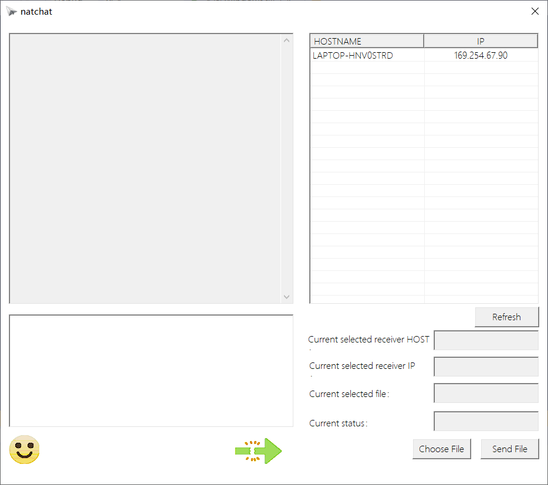
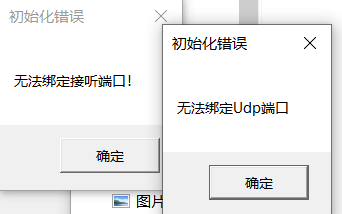

文件很大：90M。

#### 界面展示

无法同一台机器上运行：

------

fork信息：

# natchat

类似飞鸽的局域网聊天，文件传输系统

作者：
黄日昇 2015303081
刘书敏 2015303087

（这个项目写的太烂了，凑活着放上来吧_(:3」∠)_

## 项目简介

- 可以自动探测到局域网内其他设备的加入与退出，自动更新设备列表（没测试过广域网）
- 可以向其他设备群发消息、单发消息、单发文件
- 自带颜文字列表，可以自定义

项目使用 visual studio 2017 进行编写，c++11的线程库处理并发，winsock2处理tcp和udp连接，mfc编写界面。如果无法编译，请更换一下项目的 windows SDK 版本，换成在本机安装过的版本。

## 文件结构

### 网络模块
#### ConcurrentSender
负责发送一个TCP消息，本类不考虑数据的编码，只是向指定的IP和端口发送一个 tcp 数据包，在发送完毕之后结束。在实例化本类时，将开启一个新的线程来发送数据。

#### SendingManager
本模块提供了发送数据的接口，由本模块负责实例化 ConcurrentSender 并维护发送队列、确保数据发送成功。
模块使用了一个并发队列来处理消息发送。调用发送数据的方法不会等到发送完成之后才返回，而是立即返回，不会阻塞调用线程。本模块拥有一个自己的线程来处理发送队列，确保消息发送成功

#### TicToc
本模块负责处理客户端发现相关的操作。程序在启动时会开启一个 UDP 接收端，然后使用 UDP 广播一个连接请求 （TIC）。接收到此请求的客户端会使用 TCP 向发送端发送一个应答 （TOC），并将此客户端 ip 及计算机名加入到已知的计算机列表中。接收端在收到 TOC 之后也会相应的修改自己的计算机列表，这样就完成了一次客户端发现操作。在客户端要退出网络时，也会向列表中的所有计算机发送一个 BYE 消息，从而让其他客户端将本客户端从列表中删去。

#### RecevingManager
本模块负责接收TCP消息并更新消息列表、通知主线程。模块在启动时会开启一个单独的线程来启动 TCP 循环，在接收到一个TCP消息之后更新列表，发送Windows消息通知主线程进行处理。

#### ChatService
接口模块，提供了供主线程（界面）调用的函数和数据。
